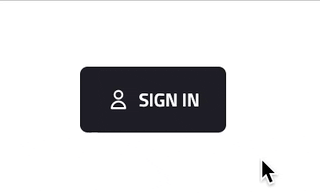

# web-components

This is a playground for building Web Components on top of [Lit](https://lit.dev) library.

## Demo



## Getting started

### Install dependencies

```
npm install
```

### Start the development server

```
npm run dev
```

### Build for production

```
npm run build
```

### Run tests

```
npm run test
```

And in watch mode:

```
npm run test:watch
```


